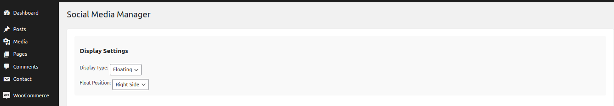
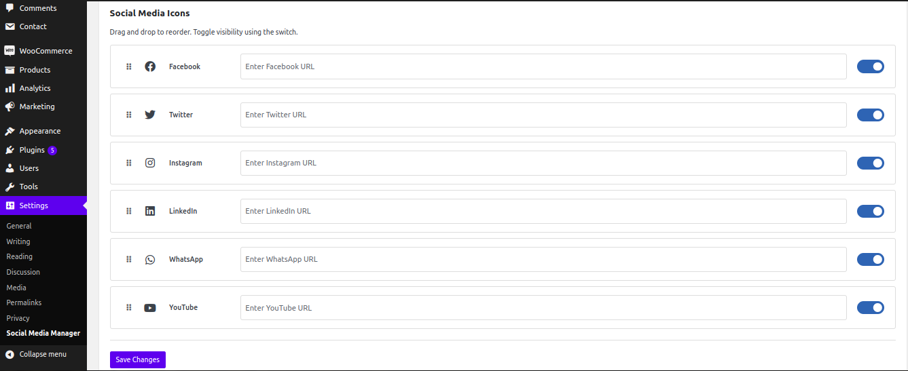

# Social Media Manager

A WordPress plugin for managing and displaying social media icons with drag-and-drop functionality and position control.

## Description
Easily manage and display social media icons on your WordPress website with full control over visibility and positioning.

## Features
* Drag & drop functionality to reorder icons
* Toggle visibility for each social platform
* Choose between header or footer display
* Shortcode support [social_media_icons]
* Platform-specific branded colors
* Responsive design for all devices
* Modern and clean interface
* Easy setup and configuration

## Installation
```bash
1. Download the plugin zip file
2. Go to WordPress admin > Plugins > Add New
3. Click "Upload Plugin"
4. Select the zip file
5. Click "Install Now"
6. Activate the plugin
```

## Usage
### Basic Setup
```php
1. Navigate to Settings > Social Media Manager
2. Enter your social media URLs
3. Toggle platforms on/off
4. Arrange using drag & drop
5. Select header/footer position
6. Save changes
```

### Using Shortcode
Add to posts/pages:
```php
[social_media_icons]
```

Add to template files:
```php
<?php echo do_shortcode('[social_media_icons]'); ?>
```

## Supported Platforms
* Facebook
* Twitter
* Instagram
* LinkedIn
* YouTube
* WhatsApp

## Requirements
* WordPress 5.0+
* PHP 7.2+
* Modern web browser

## Screenshots
#### Admin Interfaces


#### Frontend Interfaces
###### Icons on Header

###### Icons on Footer

###### Icons on Floating of the Left

###### Icons on Floating of the Right


## Contributing
Pull requests are welcome. For major changes, please open an issue first to discuss what you would like to change.

## License
[GPL v2](https://www.gnu.org/licenses/gpl-2.0.html)